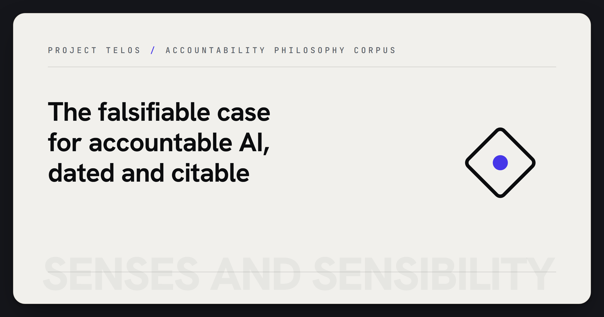

  

# Senses and Sensibility — *Conferred Existence*

> A research program in **intrinsic, bilateral accountability** — and the long-form
> philosophical corpus it is extracted from. Original scholarship by **Zain Dana Harper**.
> MIT-licensed · authored · dated 2026-06-20.

This is the *philosophy*. The accountability thesis it grounds is also built and
public — a tested, inspectable stack of organs at **[harperz9.github.io](https://harperz9.github.io)**
(see the [research page](https://harperz9.github.io/research.html)). The corpus argues
the position; the engineering instantiates it.

## The thesis, in one breath

Agentic systems perceive, decide, and act — but their claims about the world, and their
authority to change it, are *asserted*, not answerable to evidence. The claim here is that
accountability can be built as an **intrinsic, bilateral property**: every observation
carries provenance and can fail a self-test; every action passes a gate that can only
allow, deny, or escalate to a human; and the same evidentiary standard binds the maker,
not only the machine. Stated falsifiably, instantiated in a working proof-of-concept, and
honest about its own status — **pre-proof, with a stated path to a law.**

## Status — labeled, not inflated

A research program **in progress**. Chapters are at varying maturity; the central
conjecture is **pre-proof**; some arguments are load-bearing and some are still under
cross-examination (the corpus includes its own adversarial passes). Read it as live
scholarship staking its ground, not a finished dissertation.

## Where to start

- **`00-ABSTRACT.md`** — the abstract.
- **`THESIS.md`** — the concise statement of the principles and the accountable loop.
- **`INDEX.md`** · **`CATALOG.md`** — the map of the corpus.
- **`dissertation/`** — the long-form argument (the forcing argument, the membrane, the
  seam, comparative theology) and its `foundations-src/` attack↔defense dialectic.
- **`papers/`** · **`submission/`** — submission-shaped manuscripts.
- **`conferred-existence/`** — the source corpus the thesis is drawn from.

## Priority & provenance

`MANIFEST.sha256` is a content-addressed record of every file here — a provable,
dated priority stake so the work is **citable and cannot be quietly appropriated**.
Verify with `sha256sum -c MANIFEST.sha256`.

The buildable security-architecture *implementation* and the internal research tooling
are **not** part of this corpus; what is published is the scholarship.

---

*Zain Dana Harper · [harperz9.github.io](https://harperz9.github.io) · MIT · 2026.*
*Proof before trust — including about authorship.*
